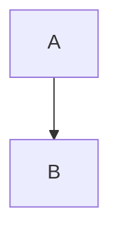

# BadPackage


<p align="center">centered</p>

> [!NOTE]
> GitHub alert.

See [the guide](docs/guide.md) and <https://example.com/autolink>.


```mermaid
graph TD; A-->B;
```

```html
<div>inside a code block is fine</div>
```
